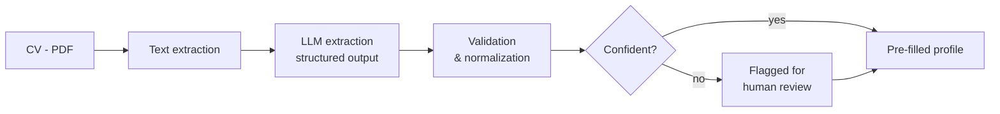

# Mission 2 — AI-Powered CV Information Extraction

> Automatically extracting key information from CVs to pre-fill candidate profiles in the recruitment platform (ATS).

## Problem

Filling candidate profiles from CVs is done manually: it is slow, repetitive and error-prone. The goal is to build a reliable AI pipeline that extracts the key fields from a CV and proposes pre-filled values, while keeping a human in the loop.

## Approach

## Contents

| Folder / file | Description |
|---|---|
| [`docs/architecture.md`](docs/architecture.md) | Pipeline architecture and design decisions |
| [`docs/extraction-schema.md`](docs/extraction-schema.md) | Fields to extract and their validation rules |
| [`docs/evaluation-protocol.md`](docs/evaluation-protocol.md) | How extraction quality is measured |
| [`src/`](src/) | Source code (published only if authorized) |
| [`tests/`](tests/) | Tests on synthetic CVs |

## Status

- [x] Process analysis (manual workflow, edge cases)
- [ ] Architecture design
- [ ] Prototype on synthetic CVs
- [ ] Evaluation dataset & metrics
- [ ] Model / prompt comparison
- [ ] Validation layer & human review flow
- [ ] Security & compliance review
- [ ] Deployment & handover
